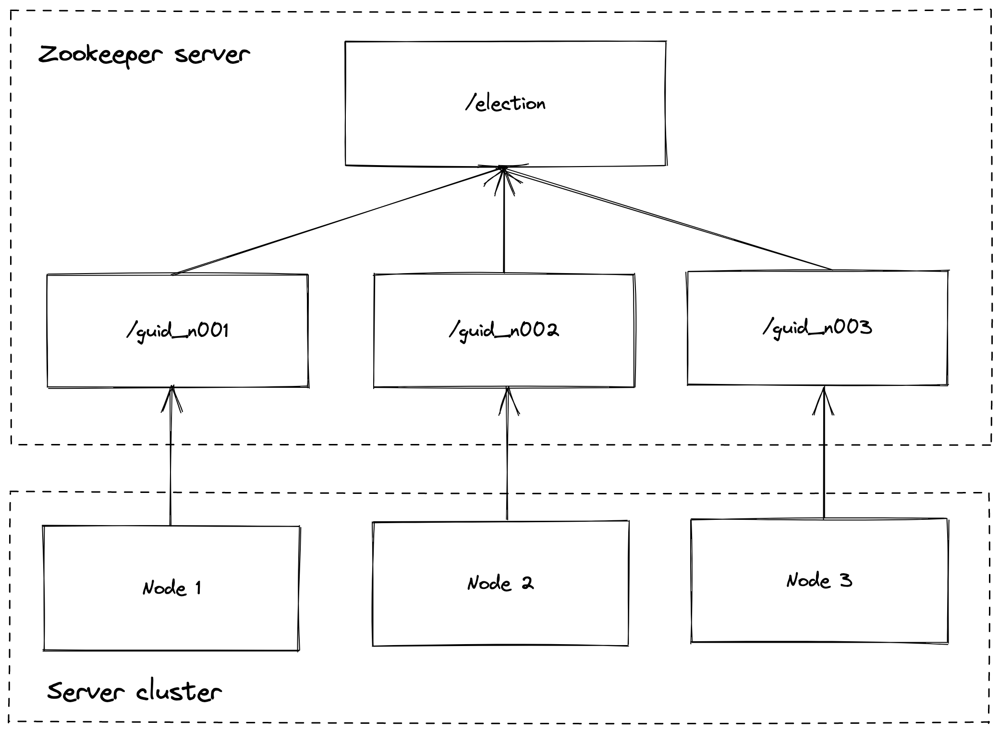
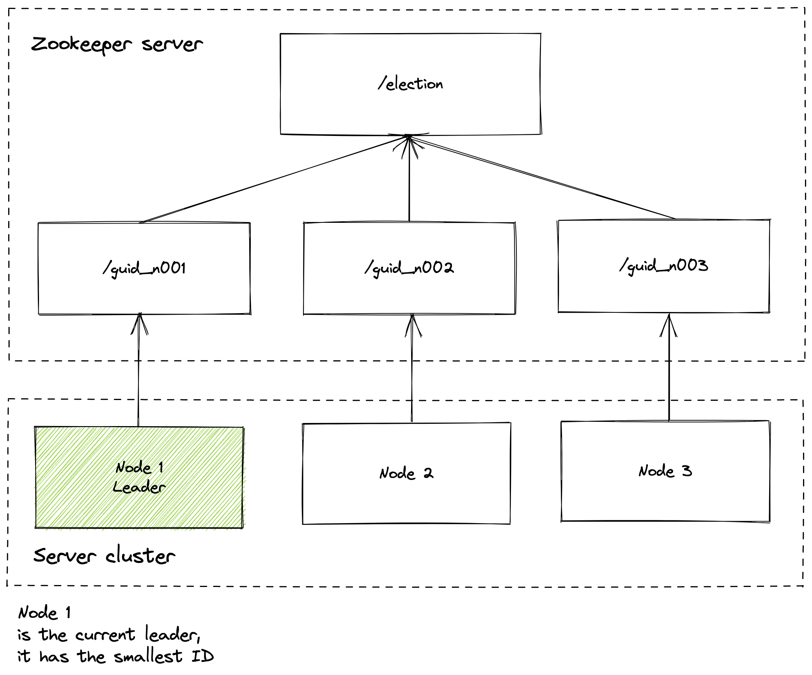
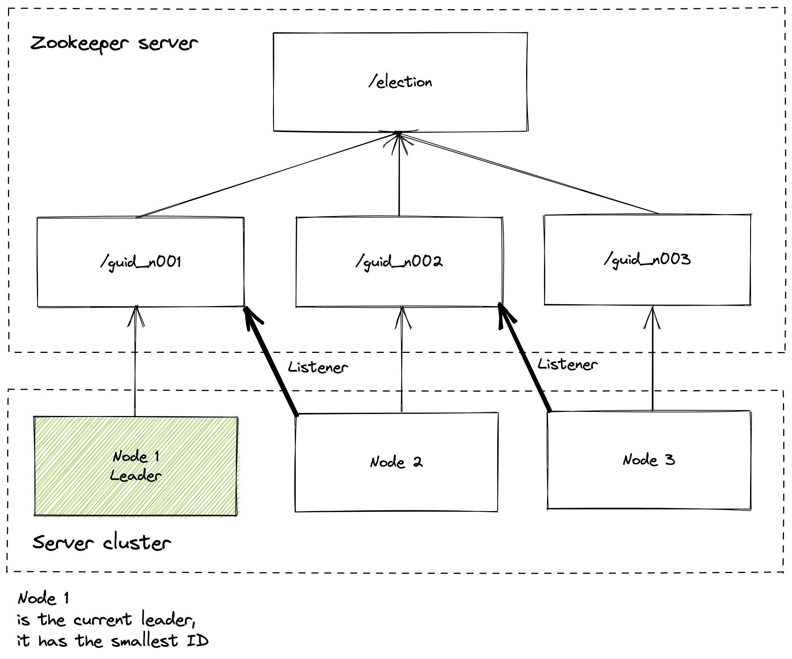

# Zookeeper Leader Election with Node

This repo contains a sample implementation of [Apache Zookeeper's Leader Election Recipe](https://zookeeper.apache.org/doc/current/recipes.html) using node.

## Overview

Apache Zookeeper is software that enables you to create highly reliable, distributed systems.

One of the things you can do with Zookeeper is build a simple leader election system. A leader election system allows you to assign a "leader" to a group of servers/nodes.
When a node is aware that it is the leader, it can perform specific actions like syncing data to follower nodes.

In a single leader distributed system, it is important that only one server thinks it is the leader (if more than one server thinks it's the leader, its called a "split mind"). It is also important that if the leader node fails for some reason, that a new node is elected the leader.

This repo shows how to set up this system using Apache Zookeeper.

## How it works

Every time a new server is spun up, it creates a new node (called a zNode) in zookeeper. Every zNode is guarenteed to have a unique, sequential ID.



Once the zNode is created, the server checks if its sequential ID is the _smallest_ ID. If it is, it delcares itself the leader.




Every other server _besides the leader_ now adds a listener that listens for when the server directly before it dies or disconnects. 



When this listener is fired, it checks if it is now the node with the smallest ID. If it is, it then declares itself the leader. If it is not, then it adds a listener to the next smallest node.


## Installation

1) Download the [latest stable release](https://zookeeper.apache.org/releases.html) of Apache Zookeeper and extract it into `./zookeeper-bin`.

2) Create the file `./zookeeper-bin/conf/zoo.cfg` and add the following configuration:

```
tickTime=2000
dataDir=/var/lib/zookeeper
clientPort=2181
```

3) Install node dependencies by running `yarn`

4) Start the Zookeeper server by running `yarn start:zookeeper`

5) Start the node server cluster by running `yarn start:client` in multiple terminals

## Testing

The first client you spin up should declare itself the leader. Every other client will be a follower.

When you shut down the first client, the second client you spun up will declare itself the leader (note that this can take a few seconds). This process continues until there are no more clients running.


